<div align="center">

# WorkPulse v2

### **Enterprise-Grade, Privacy-First Workforce Analytics & Activity Platform**

*Native Windows Rust Endpoint Agent • Real-Time Fastify & WebSocket Telemetry Engine • Modern React Admin Dashboard*

<br />

[](https://www.typescriptlang.org/)
[](https://www.rust-lang.org/)
[](https://react.dev/)
[](https://fastify.dev/)
[](https://www.mongodb.com/)
[](https://tailwindcss.com/)
[](https://playwright.dev/)

<br />

---

</div>

## 📸 Product Previews & Themes

### 🎨 Interactive Theme & Layout Switcher
*WorkPulse features 5 curated color palettes and 2 adaptive navigation modes (Topbar & Left Sidebar with ⌘K search). Click below to preview each theme:*

<details open>
<summary><b>☀️ Warm Cream (Light — Signature Classic)</b></summary>
<br/>

> *Warm parchment ground with energized coral accents and rich espresso typography.*

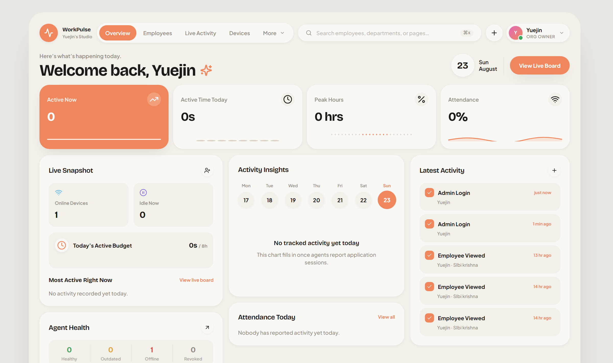
</details>

<details>
<summary><b>🌙 Obsidian Midnight (Dark — Cyber Luxury)</b></summary>
<br/>

> *Deep cosmic dark backdrop with glowing electric indigo highlights and crisp silver typography.*

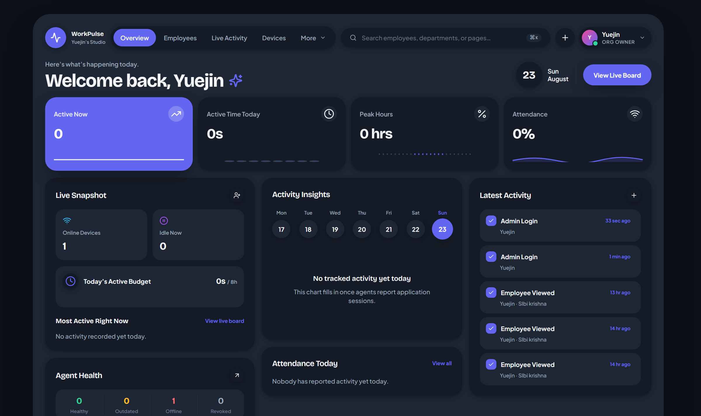
</details>

<details>
<summary><b>❄️ Nordic Frost (Light — Pure Minimalist Ice)</b></summary>
<br/>

> *Scandinavian minimalist light palette with pure porcelain cards and vivid azure sky accents.*

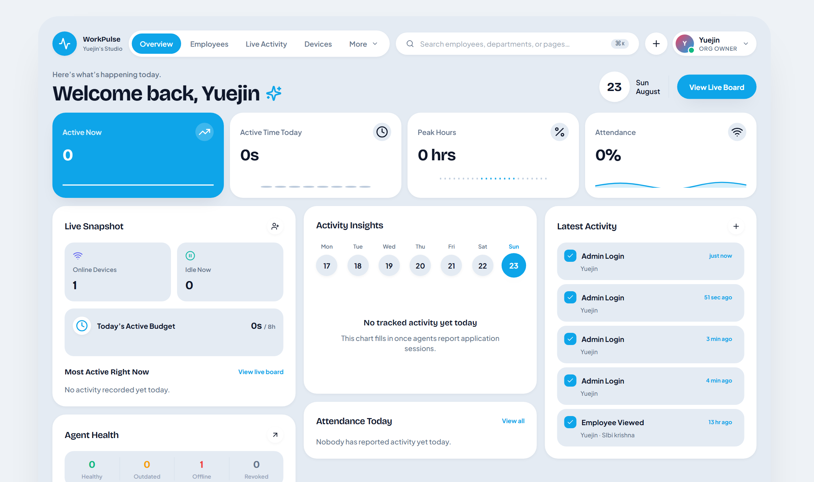
</details>

<details>
<summary><b>🌲 Emerald Forest (Dark — Velvet Botanical)</b></summary>
<br/>

> *Deep botanical dark theme with velvety evergreen tones and luminous spring mint highlights.*

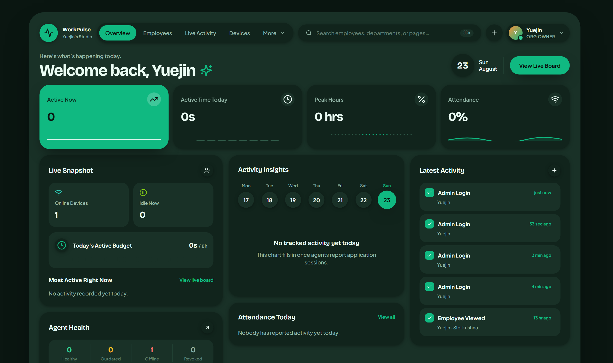
</details>

<details>
<summary><b>🌇 Cyberpunk Sunset (Dark — Synthwave Night)</b></summary>
<br/>

> *High-energy synthwave night theme with deep plum surfaces, neon rose focal points, and radiant amber micro-accents.*

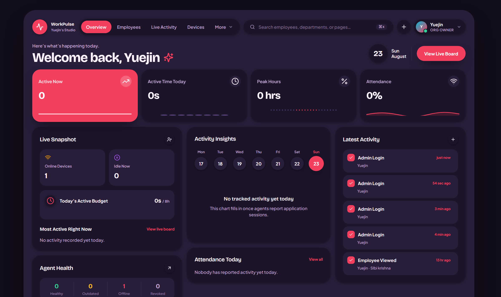
</details>

---

### 📱 Adaptive Navigation Layouts (Topbar vs. Left Sidebar)
Switch seamlessly between a sleek floating topbar and an enterprise collapsible sidebar navigation.

<div align="center">
  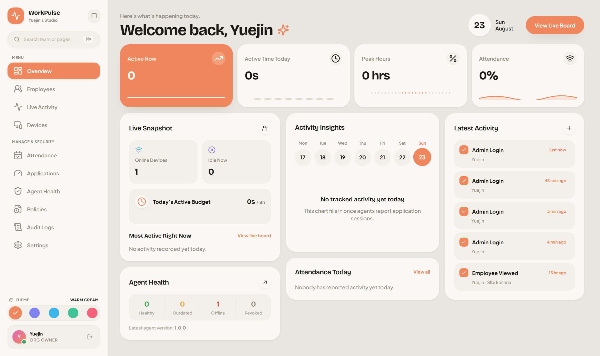
  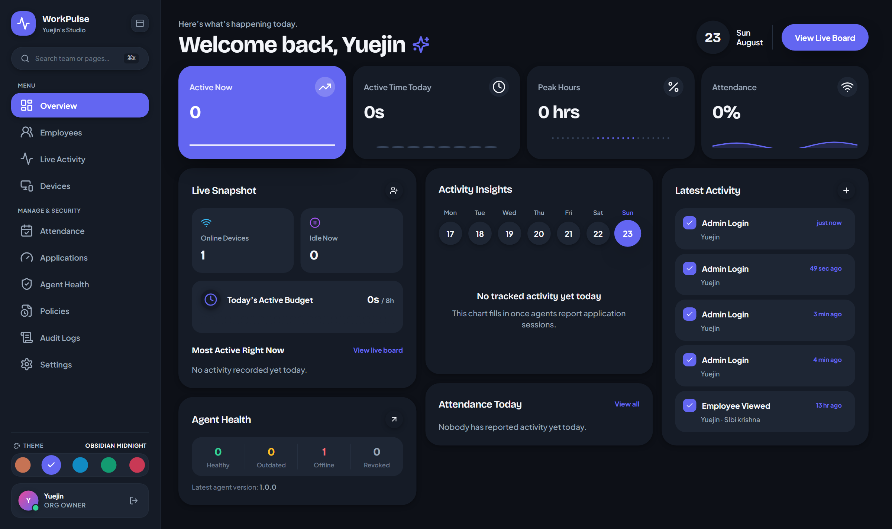
</div>

---

### ⚡ Real-Time Operations & Live Activity
Instant, live-updating visibility into team member focus, active window foreground titles, online/idle/offline status, and live heartbeats.

<div align="center">
  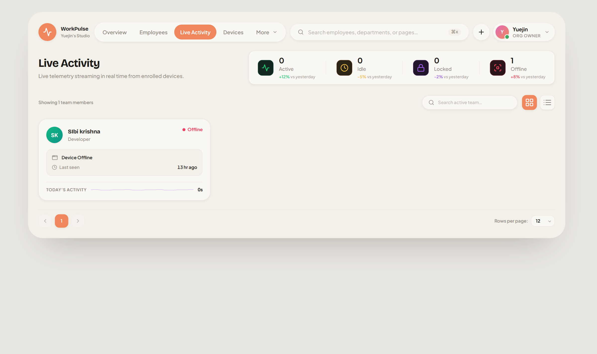
  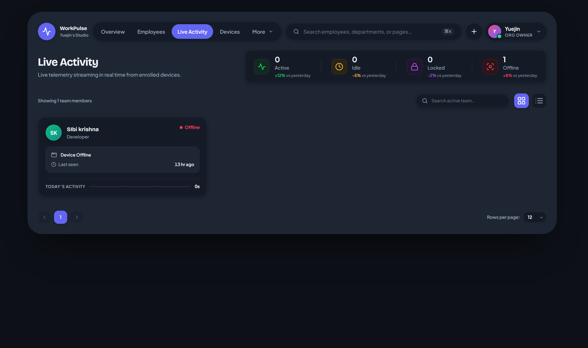
</div>

---

### 📊 Deep Work & Productivity Analytics
Track application utilization patterns categorized by productive, neutral, and distracting tools alongside automated attendance timesheets.

<div align="center">
  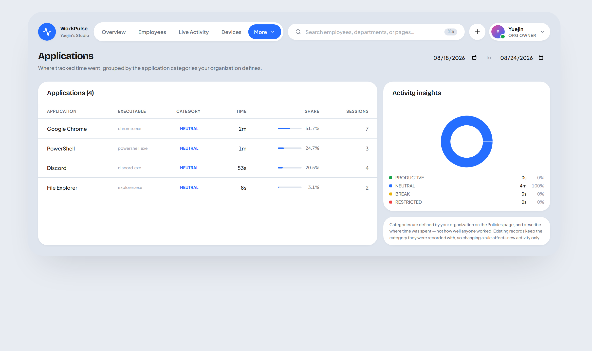
  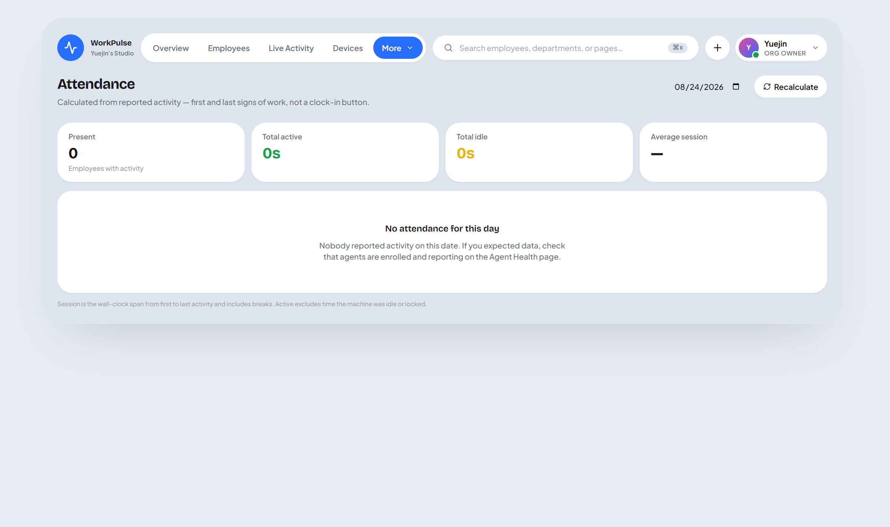
</div>

---

### 🛡️ Fleet Management & Security Policies
Manage enrolled endpoint hardware, agent telemetry health, data collection boundaries, and immutable RBAC audit logs.

<div align="center">
  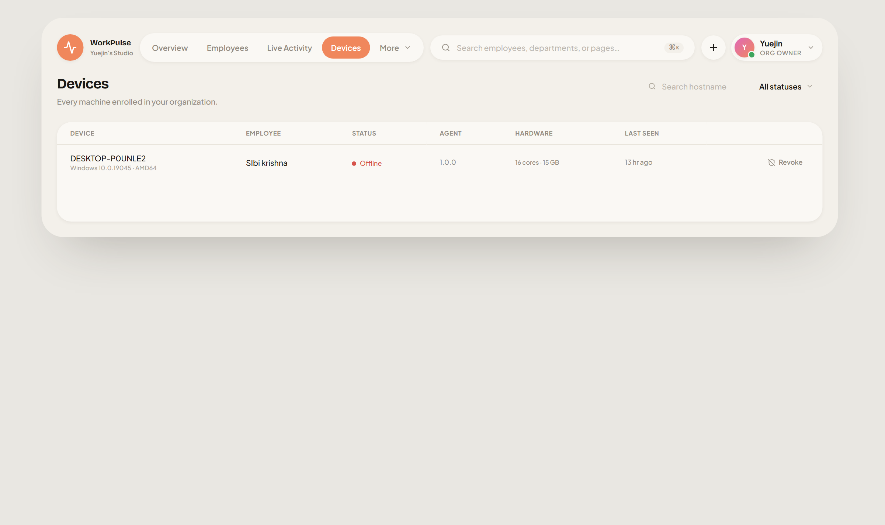
  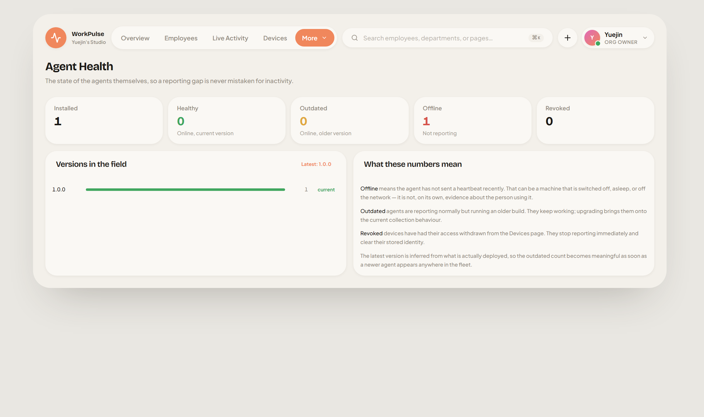
</div>

<div align="center">
  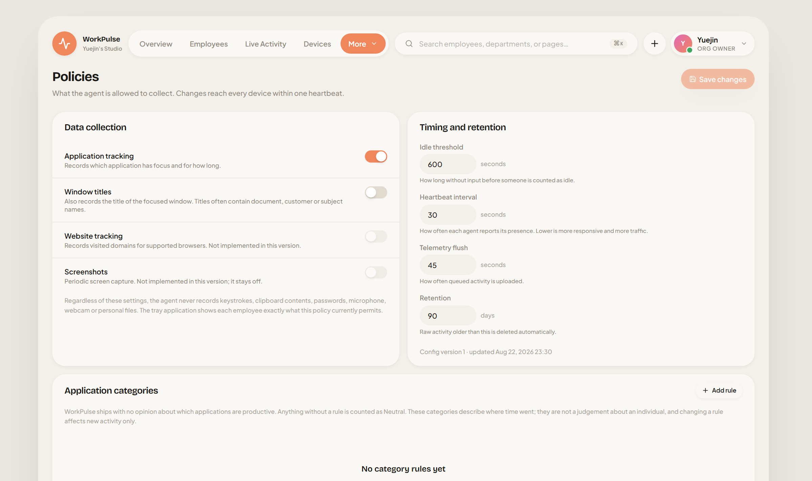
  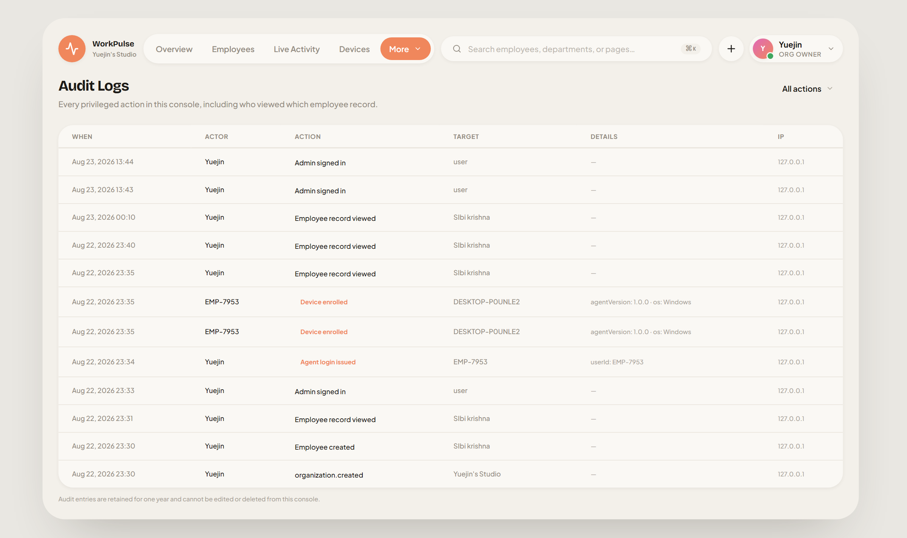
</div>

---

## 🌟 Key Highlights & Architecture

- 🛡️ **Strict Privacy by Design**: Records **activity metadata** only (application in focus, idle/locked timestamps, attendance times). **Zero keystroke logging, zero screen grabs, zero microphone/webcam access, zero clipboard reading.**
- 👁️ **Employee Transparency Tray**: Ships with `WorkPulseTray.exe` allowing employees to inspect live server collection policies and see exactly what metadata is collected in real time.
- 🦀 **Native Windows Rust Agent (`wp-agent`)**: Lightweight, robust background daemon utilizing official Windows APIs (`GetForegroundWindow`, `GetLastInputInfo`, DPAPI data protection at rest).
- ⚡ **Real-Time WebSocket Hub**: Immediate updates across executive and manager dashboards with sub-second event streaming.
- 🔒 **Enterprise-Grade RBAC**: Fine-grained role hierarchy (`TEAM_LEAD` $\rightarrow$ `MANAGER` $\rightarrow$ `HR_ADMIN` $\rightarrow$ `ORG_OWNER` $\rightarrow$ `SUPER_ADMIN`) with full audit logging.
- 🧪 **Comprehensive Test Suite**: Playwright E2E tests, vitest integration suites, simulated virtual agent swarms, and Rust unit tests.

---

## ⚡ Quick Start

### 1. Prerequisites
- **Node.js** v18+ & **npm**
- **MongoDB** v6+ (running locally on `:27017` or configured via `.env`)
- **Rust Toolchain** (optional, for compiling the native agent binary)

### 2. Installation & Seed
```bash
# Clone the repository
git clone https://github.com/Yuslash/WorkPulse.git
cd WorkPulse

# Install monorepo dependencies
npm install

# Initialize database collections and indexes
npm run db:indexes

# Seed initial organization, admin accounts, and sample employees
npm run seed
```

### 3. Launch Development Environment
```bash
npm run dev
```
- **Admin Dashboard**: [http://localhost:5173](http://localhost:5173)
- **API Server**: [http://localhost:4000](http://localhost:4000)

*Default seed credentials: `admin@acme.test` / `Admin123!pass`*

---

## 🦀 Building & Enrolling the Native Windows Agent

```bash
# 1. Build the Rust agent workspace
npm run agent:build

# 2. In Admin Dashboard: Navigate to Employees -> Select Employee -> Generate Login Credentials

# 3. Enroll device with generated one-time credentials
cd agent/target/release
./WorkPulseAgent.exe --enroll --server http://localhost:4000 \
    --user-id EMP-1234 --password 'Xk7f-2Qmb-91Zc'

# 4. Start agent service or run in console mode
./WorkPulseAgent.exe --console
```

---

## 📂 Repository Structure

```text
├── packages/
│   ├── shared/          # Zod schemas, DTOs, Enums, and Agent<->API protocol contracts
│   └── tsconfig/        # Shared TypeScript configurations
├── apps/
│   ├── admin/           # Vite + React 18 + TailwindCSS + Lucide Icons dashboard
│   ├── api/             # Fastify + MongoDB + WebSocket realtime telemetry backend
│   └── tester/          # Virtual agent load tester & workday scenario simulator
├── agent/               # Native Windows Rust workspace
│   ├── crates/wp-core/  # State machine, sessionizer, encrypted offline queue, retry logic
│   ├── crates/wp-win/   # Safe Windows OS syscall wrappers (foreground, idle, DPAPI)
│   ├── crates/wp-agent/ # WorkPulseAgent.exe CLI, enrollment, and Windows service daemon
│   └── crates/wp-tray/  # WorkPulseTray.exe system tray employee transparency app
├── docs/                # Architecture, Protocol, Privacy, and Deployment specifications
├── e2e/                 # End-to-end browser test suites with Playwright
├── preview/             # High-resolution screenshots and UI previews
└── scripts/             # Setup, Rust installer, and validation scripts
```

---

## 🧪 Verification & Quality Assurance

Run the automated test pipeline across all layers:

```bash
npm run verify
```

| Verification Stage | Scope & Coverage |
|---|---|
| **`typecheck`** | TypeScript type safety across `@workpulse/shared`, `api`, `admin`, and `tester` |
| **`api`** | Integration test suite against real MongoDB database |
| **`rust`** | Unit & property tests for Rust state machine, queue encryption, and sessionizer |
| **`system`** | Virtual agent swarm simulation validating multi-device telemetry flows |
| **`e2e`** | Playwright end-to-end browser scenarios testing UI interactions |

---

## 📖 Deep-Dive Documentation

- 📘 [System Architecture](docs/architecture.md) — Multi-tier topology, offline queueing, and data pipelines
- 🔒 [Privacy & Compliance Standards](docs/privacy.md) — What is captured, cryptographic isolation, and transparency
- 📡 [Agent-Server Protocol](docs/protocol.md) — WebSocket and REST telemetry communication specs
- 🚀 [Production Deployment Guide](docs/deployment.md) — Containerization, reverse proxying, and SSL setup

---

<div align="center">
  <sub>Built with ❤️ by the WorkPulse Team • Licensed under the MIT License</sub>
</div>
